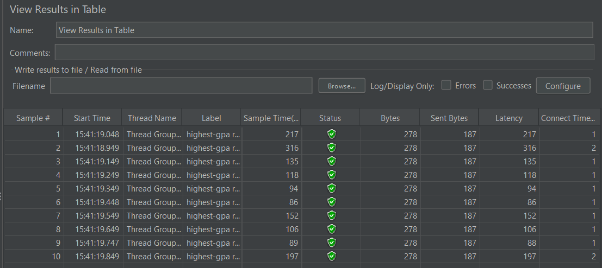

# WEEKLY ASSIGNMENT 5 REPORT

## Biodata
- **Name**: Simforianus Jonathan Flonas Harefa
- **NPM**: 2306217430
- **Class**: Adpro-B

### TEST ALL-STUDENT REQUEST

### TEST ALL-STUDENT-NAME REQUEST

### TEST HIGHEST-GPA REQUEST

### TEST ALL-STUDENT REQUEST JTL

### TEST ALL-STUDENT-NAME REQUEST JTL

### TEST HIGHEST-GPA REQUEST JTL

### TEST ALL-STUDENT-NAME REQUEST AFTER OPTIMIZATION

### TEST HIGHEST-GPA REQUEST AFTER OPTIMIZATION

### Result 
1. `/all-student-name` endpoint:
- Before Optimization: ~ 2,300 - 2,900 ms
- After Optimization: ~ 100- 450 ms
- Improvement: 84.48% reduction in execution (sample) time

2. `/highest-gpa` endpoint:
- Before Optimization: ~ 85 - 300 ms
- After Optimization: ~ 7-20 ms
- Improvement: 91.76% reduction in execution (sample) time

### Conclusion
Terdapat peningkatan performa yang ditunjukkan sebelum optimasi dan setelah optimasi pada beberapa fungsi yang ada di student service di bagian proyek exercise-profiling.
Peningkatan performa tersebut menunjukkan efketivitas dari proses optimasi yang dilakukan dan berdampak pada efisiensi runtime dan skalabilitas aplikasi.

### REFLECTION
1. Apache JMater melakukan pengukuran performa yang berbasis request-response yang berupa suatu external testing yang mengsimulasikan melakukan testing secara langsung pada url dan port yang ditentukan oleh pengembang. Sedangkan performance test pada Java Profiler Intelij IDEA berfokus pada pengkuran performa level internal seprti CPU Time, Memory allocate, dan lainnya berbasis kode dan runtime Java Virtual machine.
2. Melakukan profiling dapat membantu kita untuk mengoptimalkan CPU Usage dan Memory Usage yang digunakan untuk masing masing bagian program, mendeteksi issue yang mungkin muncul di garbage collection milik java, deteksi terhadap posibilitas memory leak, serta mampu melakukan analisa performa multi threading.
3. Intelij IDEA saya anggap membantu dalam melakuakan identifiaksi dan analisis "bottleneck" di aplikasi saya. Hal tersebut dapat dilihat lewat tools-tools yang lengkap untuk dapat mengukur matriks performa yang bervariasi lewat visualiasi graph, method list yang berjalan, visualisasi timeline, dan lainnya.
4. Kesulitan utama yang muncul adalah dalam mengambil konklusi atau data hasil profiling yang cukup kompleks untuk dimengerti, hasil profiling yang kadang inkonsisten akibat JVM optimizations, serta overhead yang disebabkan oleh profiling itu sendiri yang mampu menyebabkan false positive bottleneck. Namun, hal-hal tersebut dapat diatasi dengan melakukan testing dan profiling menggunakan tools testing yang bervariasi (intelij profiler, Apache JMeter), menjalankan profiling beberapa kali untuk melihat pola konsisten , dan melakukan samping based profiling.
5. Intelij profiler memberikan banyak keuntungan dalam melakukan profiling proyek aplikasi saya. Pertama konfigurasi yang tidak rumit sehingga dapat melakukan profiling langsung di direktori proyek apliaksi yang diakses saat ini, memungkinkan monitoring oleh pengembang apliaksi terhadap CPU Usage, memory allocation, dan activity threads secara real time saat aplikasi di jalankan.Terdapat fitur seprti call tree, method list, dan flame graph yang membantu dalam menemukan fungsi mana yang memperlambat aplikasi tanpa membaca seluruh stack trace.
6. Tahapan yang dapat saya lakukan untuk mengatasi permasalahan inkonsistensi hasil profiling antara Apache JMeter dan juga Intelij profiler dimulai dari melakukan validasi environment untuk testing yang dilakukan di JMater dan Intelij Profiler, menyamakan workload untuk masing-masing testing, memahami metrik yang bebeda dalam kedua test tersebut sehingga perlu penggabungan data sebagai bentuk analisis yang terintegrasi, serta investigasi  melakukan logging Garabace Collector behavior selama profiling Intelij dan load testing JMeter yang mampu berdampak pada runtime di Intelij Profiler.
7. Strategi yang saya gunakan agar tidak menganggu fungsionalitas aplikasi awal sebelum optimasi adalah dengan melakukan penyederhanaan atau efisisensi pada algoritma kode yang saja gunakan baik dari segi kompleksitas waktu maupun kompleksitas memori yang digunakan. Saya juga menerapkan continous integrations untuk memastikan kestabilan fungsionalitas aplikasi.